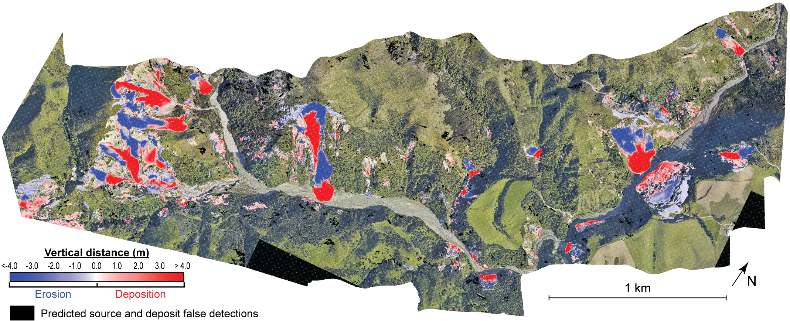

# 3D landslide detection

This repository contains the code used in Bernard et al. (2021) and a jupyter notebook of the 3D point cloud differencing workflow. It also include the Matlab code developped by Philippe Steer using TopoToolBox (Schwangharth and Scherler, 2014) to compute the Closest Deposit distance (CDD_Matlab/).

## Requierements
Software : Cloudcompare (V2.11 or later) : http://cloudcompare.org/

- pandas V1.1.5 or later
- numpy V1.19.5 or later
- laspy V1.7.0 : https://pypi.org/project/laspy/
- jupterlab V3.0.1 or later

## Data 

* The original pre-earthquake LiDAR can be found at: http://dx.doi.org/10.5069/G9G44N75 
* The original post-earthquake data can be accessible upon request from https://canterburymaps.govt.nz/about/feedback/.  

(All LiDAR data are under license: https://creativecommons.org/licenses/by/3.0/nz/) 

## Getting started
The 3D landslide detection workflow can be executed from the jupyter notebook. 

## References
Lague, D., Brodu, N., & Leroux, J. (2013). Accurate 3D comparison of complex topography with terrestrial laser scanner: Application to the Rangitikei canyon (NZ). ISPRS journal of photogrammetry and remote sensing, 82, 10-26.

Bernard, T. G., Lague, D., and Steer, P.: Beyond 2D inventories : synoptic 3D landslide volume calculation from repeat LiDAR data, Earth Surf. Dynam. Discuss. [preprint], https://doi.org/10.5194/esurf-2020-73, in review, 2020.

Schwanghart, W. and Scherler, D.: Short Communication: Topo-Toolbox 2 – MATLAB-based software for topographic analysis and modeling in Earth surface sciences, Earth Surf. Dynam., 2, 1–7, https://doi.org/10.5194/esurf-2-1-2014, 2014